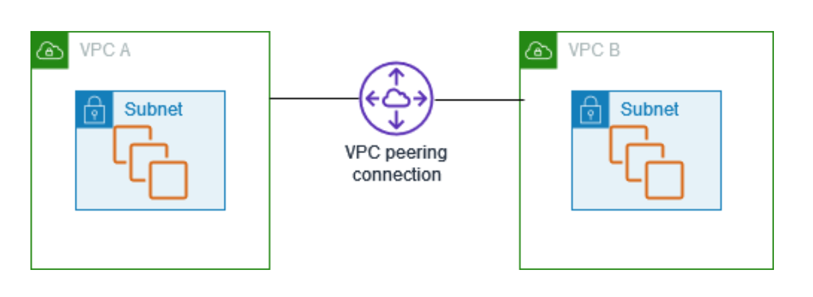

## MANAGING NETWORK INFRASTRUCTURE

Virtual private cloud and subnets. </br>
VPCs can be created via aws console, CLI and powershell.
### Commands to create VPC using CLI
````
aws ec2 create-vpc --cidr-block 12.0.0.0/16
aws ec2 create -tags --resources vpc-name --tags key=name, value=VPC2
aws ec2 describe -vpcs
aws ec2 create-subnet --vpc-id (VPC name) --cidr-block 12.0.0.0/24
````
DHCP option set </br>
DNS settings </br>
Subnetting public IP addressing </br>
Elastic IP (Static/unchanged public IP) </br>

## Connectivity and Name resolution
### VPC Peering (Establish connectivity between two VPCs through private IPs without go through internet)
````
1) Create two VPCs and subnets
2) Create peering connection
3) Accept the connection
4) Update the route table
Now both VPCs can communicate through private IPs
````


AWS Service endpoint